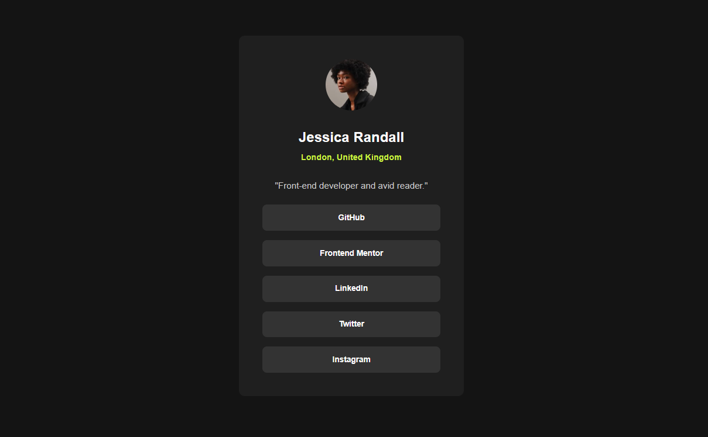
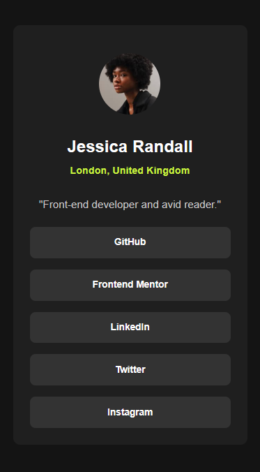

# Frontend Mentor - Social links profile solution

This is a solution to the [Social links profile challenge on Frontend Mentor](https://www.frontendmentor.io/challenges/social-links-profile-UG32l9m6dQ). Frontend Mentor challenges help you improve your coding skills by building realistic projects.

I did it to keep myself busy one evening !

## Table of contents

- [Frontend Mentor - Social links profile solution](#frontend-mentor---social-links-profile-solution)
  - [Table of contents](#table-of-contents)
  - [Overview](#overview)
    - [The challenge](#the-challenge)
    - [Screenshot](#screenshot)
    - [Links](#links)
  - [My process](#my-process)
    - [Built with](#built-with)
  - [Author](#author)

## Overview

### The challenge

Users should be able to:

- See hover and focus states for all interactive elements on the page

### Screenshot

Desktop:

Phone 375px:

### Links

- Solution URL: [Add solution URL here](https://github.com/GuilhemJoly/social-links-profil-main)
- Live Site URL: [Add live site URL here](https://social-links-profil-main.vercel.app/)

## My process

### Built with

- Semantic HTML5 markup
- CSS custom properties
- Flexbox

## Author

- Website - [Guilhem Joly](https://guilhemjoly.vercel.app/)
- Frontend Mentor - [@GuilhemJoly](https://www.frontendmentor.io/profile/GuilhemJoly)
- Twitter - [@GuilhemJoly](https://x.com/GuilhemJoly)
